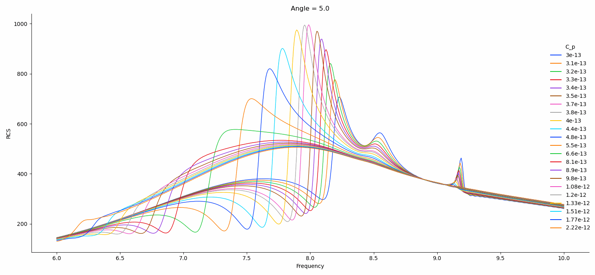

# Electromagnetic responce approximation
## STATUS: In progress

 
Physical simulations can take an immense amount of time, so in this work I have tried to use Deep Learning to speed up this process.
 Based on PyTorch. 
 

 
 
 
